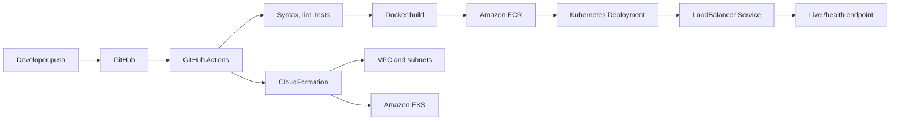

# PulseCheck EKS DevOps Assessment

PulseCheck is a lightweight Python health-check microservice built for the DevOps screening assignment. This repository completes Option A: a containerized FastAPI application, local pipeline proof, GitHub Actions CI/CD, CloudFormation infrastructure, Amazon ECR, Amazon EKS, and Kubernetes manifests for a public `/health` endpoint.

## Architecture



## What Is Included

| Assignment requirement | Implementation |
|---|---|
| Python health-check app | FastAPI service exposing `/`, `/health`, `/ready`, and `/live`. |
| Real system or external check | Disk and memory checks always run; optional external dependency check runs when `HEALTHCHECK_URL` is set. |
| Containerization | Dockerfile uses Python 3.12 slim, non-root user, health check, and port `8000`. |
| Unit or syntax tests | `python -m compileall`, Ruff, CloudFormation lint, and Pytest are wired into `make ci` and GitHub Actions. |
| CI/CD on push | `.github/workflows/ci-cd.yml` validates, builds, smoke-tests, pushes to ECR, and deploys to EKS when enabled. |
| Simulated deployment | `scripts/local_pipeline.sh` renders Kubernetes manifests and performs a client-side dry run when `kubectl` is available. |
| CloudFormation IaC | Split templates provision ECR, VPC/networking, GitHub OIDC role, EKS cluster, IAM roles, node group, and add-ons. |
| Cloud-native showcase | Kubernetes `LoadBalancer` service exposes `http://<load-balancer>/health`. |
| Cleanup | `scripts/cleanup.sh` removes Kubernetes resources and CloudFormation stacks in safe order. |

## Demo Video

The 3-minute assessment walkthrough is included here:

[Watch or download the demo video](docs/demo/pulsecheck-demo.mov)

## Demo Evidence

Final screenshots are included in [docs/screenshots](docs/screenshots/README.md):

| Evidence | Screenshot path |
|---|---|
| GitHub Actions pipeline success | [docs/screenshots/github-actions-success.png](docs/screenshots/github-actions-success.png) |
| Local pipeline passing | [docs/screenshots/local-pipeline-pass.png](docs/screenshots/local-pipeline-pass.png) |
| Docker container `/health` response | [docs/screenshots/docker-local-health.png](docs/screenshots/docker-local-health.png) |
| CloudFormation stacks complete | [docs/screenshots/cloudformation-stacks.png](docs/screenshots/cloudformation-stacks.png) |
| EKS pods and LoadBalancer service | [docs/screenshots/kubectl-pods-service.png](docs/screenshots/kubectl-pods-service.png) |
| Live `/health` endpoint response | [docs/screenshots/live-health-endpoint.png](docs/screenshots/live-health-endpoint.png) |

Together, these screenshots show the passing GitHub Actions run, local validation, local container health response, completed CloudFormation stacks, running EKS pods with the public LoadBalancer service, and the live `/health` endpoint returning `healthy`.

## Repository Structure

```text
.
|-- app/
|   |-- __init__.py
|   `-- main.py
|-- tests/
|   `-- test_health.py
|-- cloudformation/
|   |-- 01-ecr.yaml
|   |-- 02-network.yaml
|   |-- 03-github-oidc-deploy-role.yaml
|   `-- 04-eks-cluster-nodegroup.yaml
|-- k8s/
|   |-- namespace.yaml
|   |-- deployment.yaml
|   `-- service.yaml
|-- scripts/
|   |-- cleanup.sh
|   |-- deploy_app.sh
|   |-- deploy_infra.sh
|   |-- get_endpoint.sh
|   |-- local_pipeline.sh
|   `-- setup_github_oidc.sh
|-- docs/
|   |-- demo/
|   |   `-- pulsecheck-demo.mov
|   `-- screenshots/
|       `-- README.md
|-- .github/workflows/ci-cd.yml
|-- Dockerfile
|-- Makefile
|-- requirements.txt
`-- requirements-dev.txt
```

## Local Run

Create a virtual environment, install dependencies, and run the app:

```bash
python3 -m venv .venv
source .venv/bin/activate
python -m pip install --upgrade pip
python -m pip install -r requirements-dev.txt
make run
```

In another terminal:

```bash
curl http://127.0.0.1:8000/health
```

Example response:

```json
{
  "service": "pulsecheck",
  "status": "healthy",
  "timestamp": "2026-07-05T00:00:00Z",
  "checks": {
    "app": {"status": "ok"},
    "disk": {"status": "ok"},
    "memory": {"status": "ok"},
    "external_dependency": {"status": "skipped"}
  }
}
```

## Local Pipeline Proof

Run the same local validation expected in the demo:

```bash
make ci
```

`make ci` performs syntax validation, Python linting, CloudFormation linting, unit tests, Docker build, container smoke test, and Kubernetes deployment simulation.

## Docker

```bash
docker build -t pulsecheck:local .
docker run --rm -p 8000:8000 pulsecheck:local
curl http://127.0.0.1:8000/health
```

## AWS Defaults

| Setting | Default |
|---|---|
| AWS region | `ap-south-1` |
| Project name | `pulsecheck` |
| ECR repository | `pulsecheck` |
| EKS cluster | `pulsecheck-eks` |
| Kubernetes version | `1.36` |
| Kubernetes namespace | `pulsecheck` |

The network stack creates public and private subnet pairs. To avoid unnecessary demo cost, the default node group uses public subnets and does not create a NAT Gateway. For a more production-like private node group, deploy networking with `CreateNatGateway=true` and deploy EKS with `NodeSubnetTier=private`.

## Current Live Endpoint

The assessment deployment is running in `ap-south-1`:

```text
http://a12e2ccfc5cc247989e1772f1335f334-1852857093.ap-south-1.elb.amazonaws.com/health
```

The Kubernetes service uses a standard internet-facing AWS `LoadBalancer` service and forwards port `80` to the PulseCheck container on port `8000`.

For this assessment, the standard Kubernetes `LoadBalancer` service is intentionally simple and easy to demonstrate. A production EKS deployment could use the AWS Load Balancer Controller for more advanced load-balancer management.

## One-Time GitHub OIDC Setup

GitHub Actions should use OIDC instead of long-lived AWS keys. From a terminal with AWS credentials:

```bash
export AWS_REGION=ap-south-1
export GITHUB_ORG=areeb24111
export GITHUB_REPO=pulsecheck-eks-devops
./scripts/setup_github_oidc.sh
```

Copy the `GitHubActionsRoleArn` stack output into the GitHub repository secret `AWS_ROLE_TO_ASSUME`.

Then add these GitHub repository variables:

| Type | Name | Value |
|---|---|---|
| Variable | `AWS_REGION` | `ap-south-1` |
| Variable | `ENABLE_AWS_DEPLOY` | `true` |

## Deploy Infrastructure Manually

```bash
export AWS_REGION=ap-south-1
export DEPLOY_PRINCIPAL_ARN=<GitHubActionsRoleArn optional>
export ADDITIONAL_ADMIN_PRINCIPAL_ARN=<local IAM user/role ARN optional>
./scripts/deploy_infra.sh
```

This deploys the ECR, network, and EKS stacks.

## Deploy Application Manually

```bash
export AWS_REGION=ap-south-1
./scripts/deploy_app.sh
```

The script builds an image tagged with the current Git commit SHA, pushes it to ECR, updates kubeconfig, deploys Kubernetes manifests, waits for rollout, and prints the live URL. On Apple Silicon, it defaults to `DOCKER_PLATFORM=linux/amd64` so the image runs on the default `t3.small` EKS nodes.

Get the endpoint again:

```bash
./scripts/get_endpoint.sh
```

Test it:

```bash
curl http://<load-balancer-hostname>/health
```

## GitHub Actions

The workflow always runs local-quality checks on pushes and pull requests. On `main`, the AWS deployment job runs only when `ENABLE_AWS_DEPLOY=true` and `AWS_ROLE_TO_ASSUME` is configured.

The deploy job:

1. Assumes the AWS deploy role with GitHub OIDC.
2. Deploys CloudFormation stacks.
3. Builds and pushes `pulsecheck:<git-sha>` to ECR.
4. Applies Kubernetes manifests to EKS.
5. Waits for rollout.
6. Prints the `/health` endpoint to the job summary.

## Cleanup

Run cleanup after the assessment review to avoid AWS charges:

```bash
export AWS_REGION=ap-south-1
./scripts/cleanup.sh
```

The cleanup script deletes the Kubernetes service first so AWS removes the load balancer before CloudFormation deletes the cluster and VPC.
